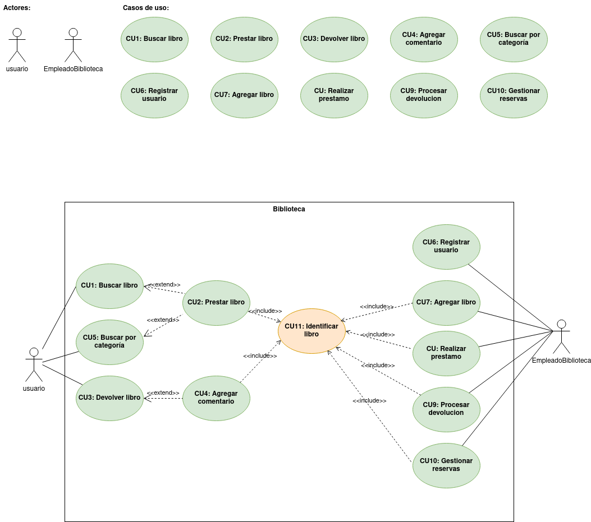
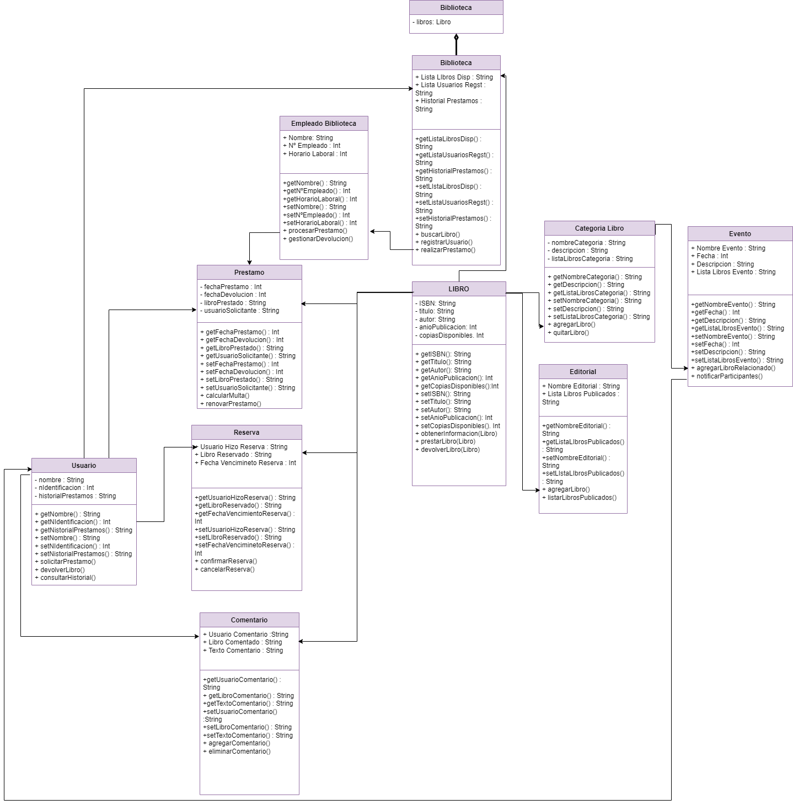

# Proyecto Biblioteca 1 DAM Daniel Alejandro Rodriguez Herrera y Nerea González Pérez

### Indice
- [Enunciado](#enunciado)
- [Diagrama CU](#diagrama-de-casos-de-usos)
- [Tablas CU](#tabla-de-casos-de-uso)
- [Diagrama de clases](#diagrama-de-clases)

## Enunciado
```
Desarrolla un sistema de llamado Gestión de Biblioteca que permita a los bibliotecarios buscar, prestar y devolver libros en una biblioteca. El sistema debe tener una interfaz de usuario simple (Main con menú) y proporcionar funcionalidades básicas de administración de libros, como: (obtenerInformacion (identificadorLibro),prestarLibro(identificadorLibro),devolverLibro(identificadorLibro),agregarComentario(identificadorLibro),consultarComentarios(identificadorLibro),verificarDisponibilidad(identificadorLibro)). Además el sistema permitirá dar de alta/modificación/búsqueda/eliminación de usuarios y libros.
```
 https://github.com/jpexposito/docencia/tree/master/Primero/ETS/PROYECTO


## Diagrama de Casos de usos



## Tabla de casos de uso

  |  Caso de Uso	CU | 1  |
  |---|---|
  | Fuentes  | _https://github.com/jpexposito/docencia/tree/master/Primero/ETS/PROYECTO_  |
  | Actor  |  _Usuario_ |
  | Descripción | _Buscar libro_  |
  | Flujo básico | _1-Buscar libro_ |
  | Pre-condiciones | _N/D_  |  
  | Post-condiciones  | _N/D_  |  
  |  Requerimientos | _N/D_  |
  |  Notas |  _Puede suceder una post condición_ |
  | Autor  | _Daniel Alejandro Rodriguez Herrera y Nerea González Pérez_ |
  |Fecha | _20/12/2023_ |

  |  Caso de Uso	CU | 2  |
  |---|---|
  | Fuentes  | _https://github.com/jpexposito/docencia/tree/master/Primero/ETS/PROYECTO_  |
  | Actor  |  _Usuario_ |
  | Descripción | _Prestar libro_  |
  | Flujo básico | _1-Buscar libro/Buscar por categoria>2-Prestar libro_ |
  | Pre-condiciones | _Buscar libro o Buscar por categoria_  |  
  | Post-condiciones  | _N/D_  |  
  |  Requerimientos | _Identificar libro_  |
  |  Notas |  _N/D_ |
  | Autor  | _Daniel Alejandro Rodriguez Herrera y Nerea González Pérez_ |
  |Fecha | _20/12/2023_ |

  |  Caso de Uso	CU | 3  |
  |---|---|
  | Fuentes  | _https://github.com/jpexposito/docencia/tree/master/Primero/ETS/PROYECTO_  |
  | Actor  |  _Usuario_ |
  | Descripción | _Devolver libro_  |
  | Flujo básico | _1-Devolver libro_ |
  | Pre-condiciones | _N/D_  |  
  | Post-condiciones  | _N/D_  |  
  |  Requerimientos | _N/D_  |
  |  Notas |  _Puede suceder una post condición_ |
  | Autor  | _Daniel Alejandro Rodriguez Herrera y Nerea González Pérez_ |
  |Fecha | _20/12/2023_ |

  |  Caso de Uso	CU | 4  |
  |---|---|
  | Fuentes  | _https://github.com/jpexposito/docencia/tree/master/Primero/ETS/PROYECTO_  |
  | Actor  |  _Usuario_ |
  | Descripción | _Agregar comentario_  |
  | Flujo básico | _1-Devolver libro>2-Agregar comentario_ |
  | Pre-condiciones | _Devolver libro_  |  
  | Post-condiciones  | _N/D_  |  
  |  Requerimientos | _Identificar libro_  |
  |  Notas |  _N/D_ |
  | Autor  | _Daniel Alejandro Rodriguez Herrera y Nerea González Pérez_ |
  |Fecha | _20/12/2023_ |

  |  Caso de Uso	CU | 5  |
  |---|---|
  | Fuentes  | _https://github.com/jpexposito/docencia/tree/master/Primero/ETS/PROYECTO_  |
  | Actor  |  _Usuario_ |
  | Descripción | _Buscar por categoria_  |
  | Flujo básico | _1-Buscar por categoria_ |
  | Pre-condiciones | _N/D_  |  
  | Post-condiciones  | _N/D_  |  
  |  Requerimientos | _N/D_  |
  |  Notas |  _Puede suceder una post condición_ |
  | Autor  | _Daniel Alejandro Rodriguez Herrera y Nerea González Pérez_ |
  |Fecha | _20/12/2023_ |

  |  Caso de Uso	CU | 6  |
  |---|---|
  | Fuentes  | _https://github.com/jpexposito/docencia/tree/master/Primero/ETS/PROYECTO_  |
  | Actor  |  _EmpleadoBiblioteca_ |
  | Descripción | _Registrar usuario_  |
  | Flujo básico | _1-Registrar usuario_ |
  | Pre-condiciones | _N/D_  |  
  | Post-condiciones  | _N/D_  |  
  |  Requerimientos | _N/D_  |
  |  Notas |  _N/D_ |
  | Autor  | _Daniel Alejandro Rodriguez Herrera y Nerea González Pérez_ |
  |Fecha | _20/12/2023_ |

  |  Caso de Uso	CU | 7  |
  |---|---|
  | Fuentes  | _https://github.com/jpexposito/docencia/tree/master/Primero/ETS/PROYECTO_  |
  | Actor  |  _EmpleadoBiblioteca_ |
  | Descripción | _Agregar libro_  |
  | Flujo básico | _1-Agregar libro_ |
  | Pre-condiciones | _N/D_  |  
  | Post-condiciones  | _N/D_  |  
  |  Requerimientos | _Identificar libro_  |
  |  Notas |  _N/D_ |
  | Autor  | _Daniel Alejandro Rodriguez Herrera y Nerea González Pérez_ |
  |Fecha | _20/12/2023_ |

  |  Caso de Uso	CU | 8  |
  |---|---|
  | Fuentes  | _https://github.com/jpexposito/docencia/tree/master/Primero/ETS/PROYECTO_  |
  | Actor  |  _EmpleadoBiblioteca_ |
  | Descripción | _Realizar prestamo_  |
  | Flujo básico | _1-Realizar prestamo_ |
  | Pre-condiciones | _N/D_  |  
  | Post-condiciones  | _N/D_  |  
  |  Requerimientos | _Identificar libro_  |
  |  Notas |  _N/D_ |
  | Autor  | _Daniel Alejandro Rodriguez Herrera y Nerea González Pérez_ |
  |Fecha | _20/12/2023_ |

  |  Caso de Uso	CU | 9  |
  |---|---|
  | Fuentes  | _https://github.com/jpexposito/docencia/tree/master/Primero/ETS/PROYECTO_  |
  | Actor  |  _EmpleadoBiblioteca_ |
  | Descripción | _Procesar devolucion_  |
  | Flujo básico | _1-Procesar devolucion_ |
  | Pre-condiciones | _N/D_  |  
  | Post-condiciones  | _N/D_  |  
  |  Requerimientos | _Identificar libro_  |
  |  Notas |  _N/D_ |
  | Autor  | _Daniel Alejandro Rodriguez Herrera y Nerea González Pérez_ |
  |Fecha | _20/12/2023_ |

  |  Caso de Uso	CU | 10  |
  |---|---|
  | Fuentes  | _https://github.com/jpexposito/docencia/tree/master/Primero/ETS/PROYECTO_  |
  | Actor  |  _EmpleadoBiblioteca_ |
  | Descripción | _Gestionar reserva_  |
  | Flujo básico | _1-Gestionar reserva_ |
  | Pre-condiciones | _N/D_  |  
  | Post-condiciones  | _N/D_  |  
  |  Requerimientos | _Identificar libro_  |
  |  Notas |  _N/D_ |
  | Autor  | _Daniel Alejandro Rodriguez Herrera y Nerea González Pérez_ |
  |Fecha | _20/12/2023_ |

## Diagrama de clases

