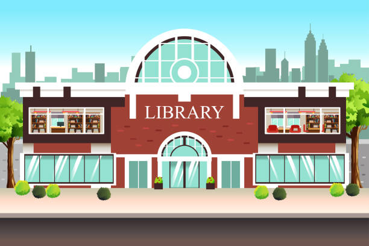

# Anteproyecto - (Proyecto-Biblioteca)

## Nerea Glez
### 1º DAM

## Indice

- [Enunciado](../README.md/#enunciado)
- [Diagrama CU](../README.md)
- [Tablas CU](../README.md/#tabla-de-casos-de-uso)
- [Diagrama de clases](../README.md)

### Descripción del problema.

>Crear un programa de una biblioteca, que permita realizar acciones dentro de la misma. 
Ejemplos: Comprar Libros...
### Objetivo.

>Con este proyecto, queremos que todos los usuarios de la biblioteca tengan una oportunidad mas facil para hacer los servivios deseados.

### Arquitectura y tecnologías a utilizar.

>Para realizar este proyecto utilizaremos la aplicacion diagrams.app para hacer los diagramas de casos de uso y de clases. 

