# Diagrama- Actividad

## Índice
- [Diagrama de actividad para el  C.U. 1](#cu-1-buscar-libro)
- [Diagrama de actividad para el C.U. 2](#cu-2-prestar-libro)
- [Diagrama de actividad para el C.U. 3](#cu-3-devolver-libro)
- [Diagrama de actividad para el C.U. 4](#cu-4-seleccionar-libro)
- [Diagrama de actividad para el C.U. 5](#cu-5-dejar-comentario)
- [Diagrama de actividad para el C.U. 6](#cu-6-ver-lista-libros)
- [Diagrama de actividad para el C.U. 7](#cu-7-registrar-usuario)
- [Diagrama de actividad para el C.U. 8](#cu-8-agregar-libro)
- [Diagrama de actividad para el C.U. 9](#cu-9-gestionar-reserva-libro)
- [Diagrama de actividad para el C.U. 10](#cu-10-buscar-por-título)
- [Diagrama de actividad para el C.U. 11](#cu-11-buscar-por-autor)
- [Diagrama de actividad para el C.U. 12](#cu-12-buscar-por-categoría)
- [Diagrama de actividad para el C.U. 13](#cu-13-visualizar-información)
- [Diagrama de actividad para el C.U. 14](#cu-14-modificar-información)

***
### C.U. 1 Buscar Libro
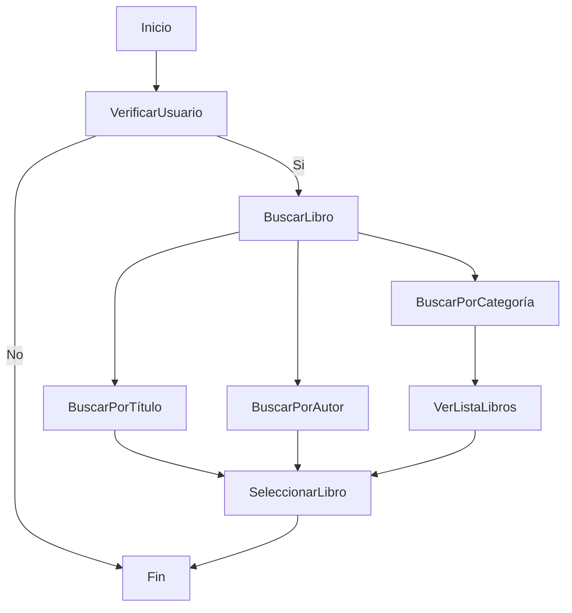
### C.U. 2 Prestar Libro
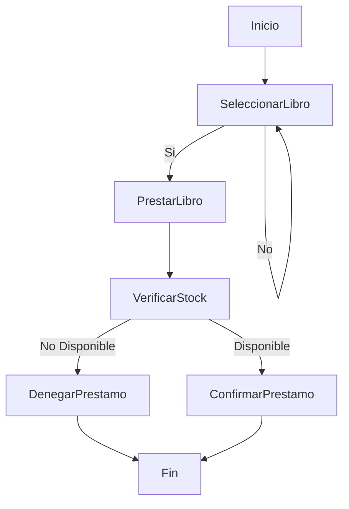
### C.U. 3 Devolver Libro
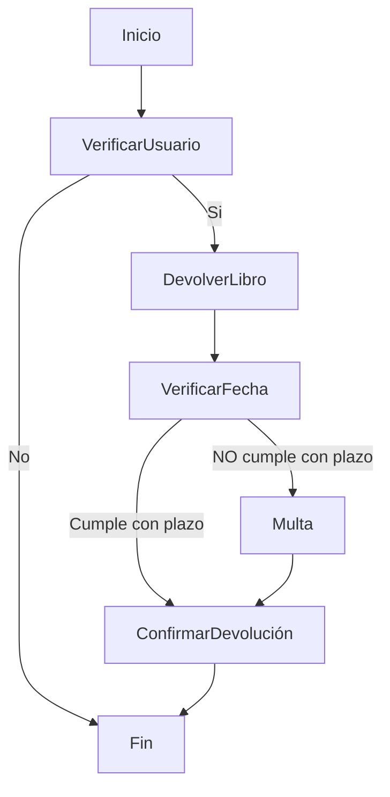

### C.U. 4 Seleccionar Libro
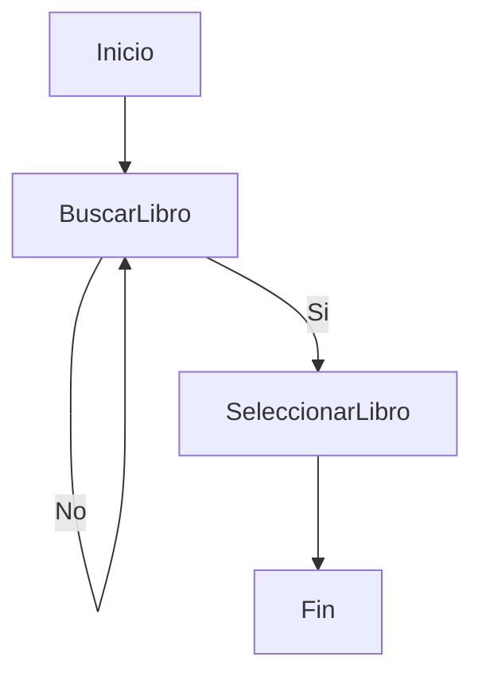

### C.U. 5 Dejar Comentario
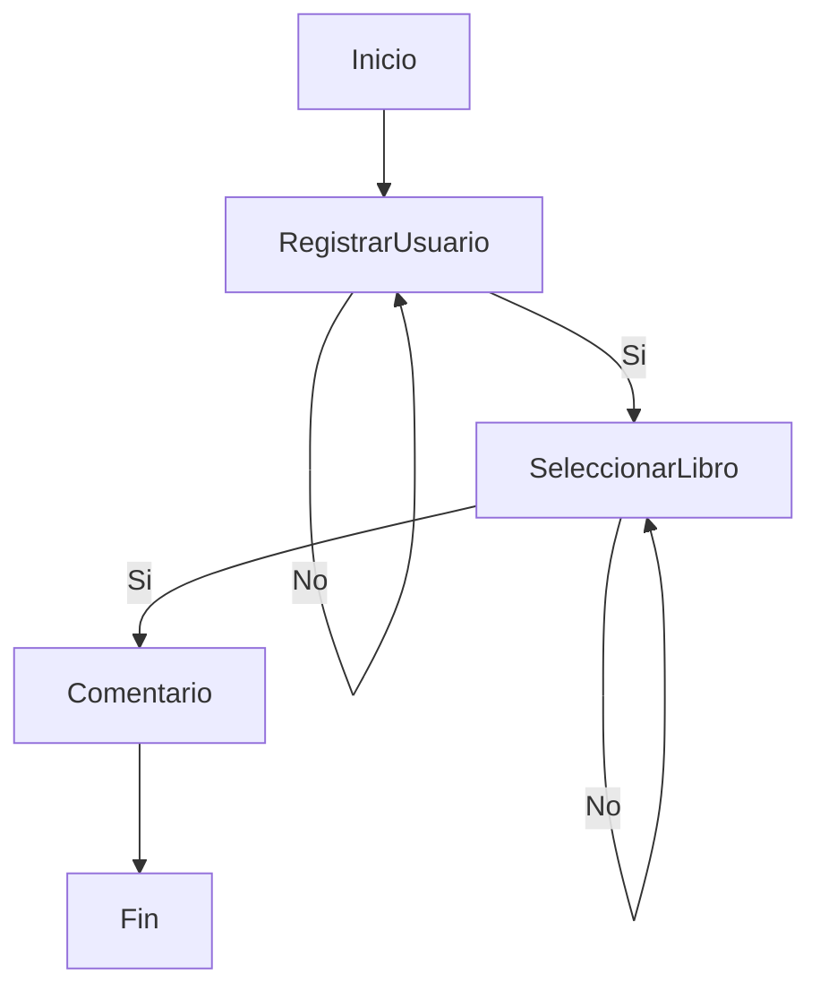

### C.U. 6 Ver Lista Libros
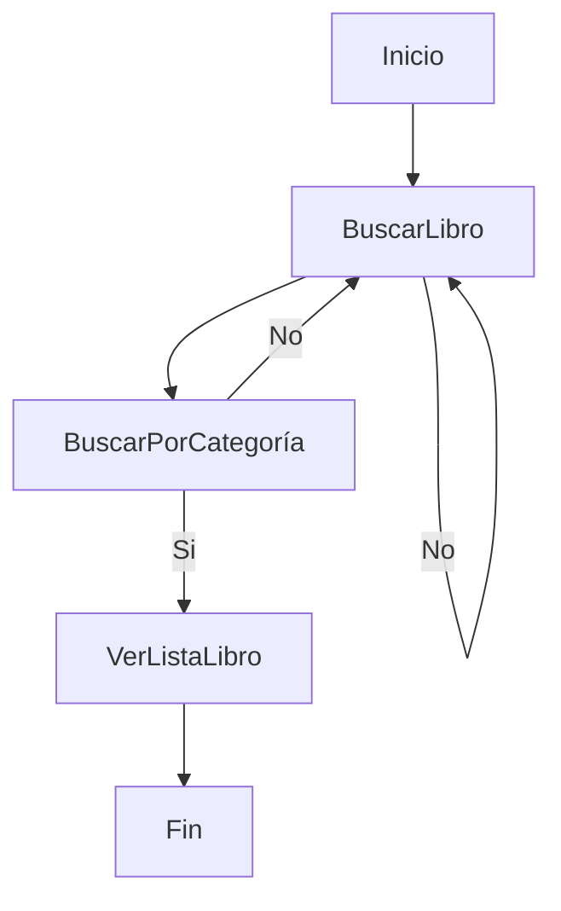

### C.U. 7 Registrar Usuario
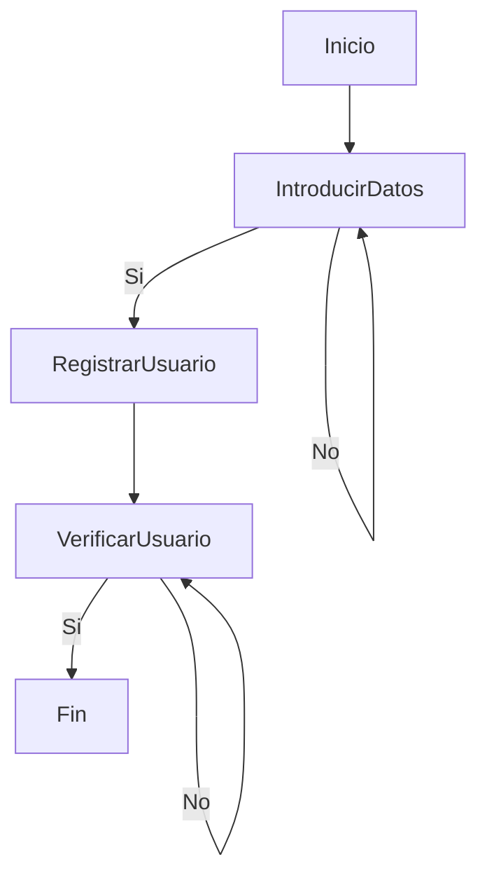

### C.U. 8 Agregar Libro
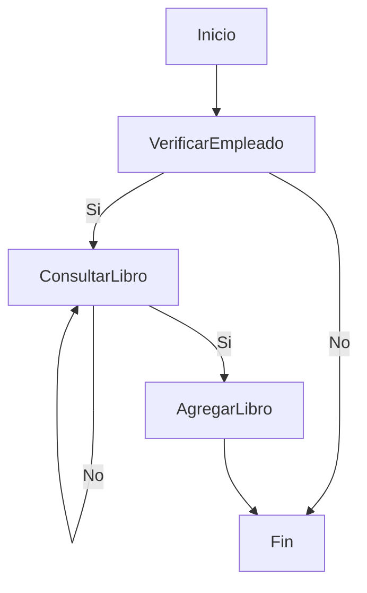

### C.U. 9 Gestionar Reserva Libro
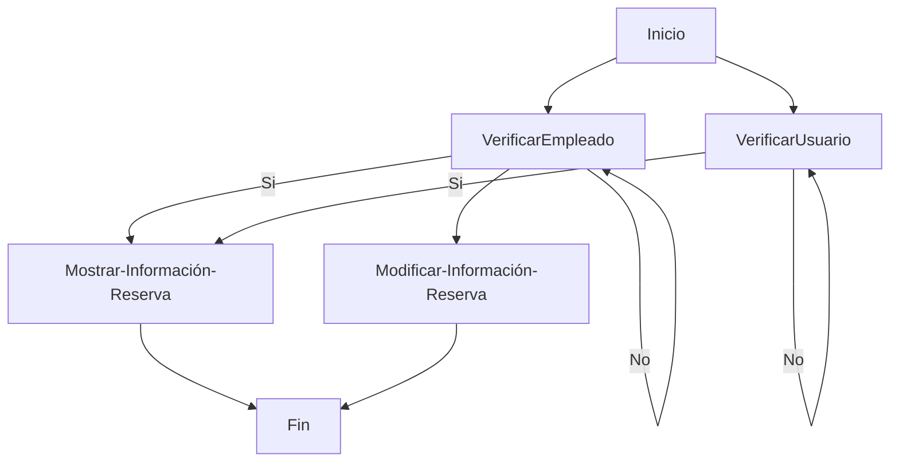

### C.U. 10 Buscar por Título
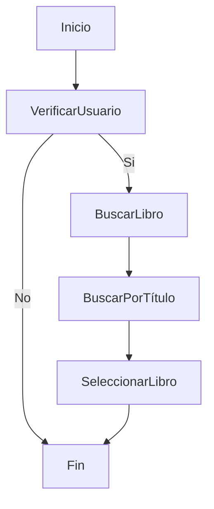

### C.U. 11 Buscar por Autor

### C.U. 12 Buscar por Categoría
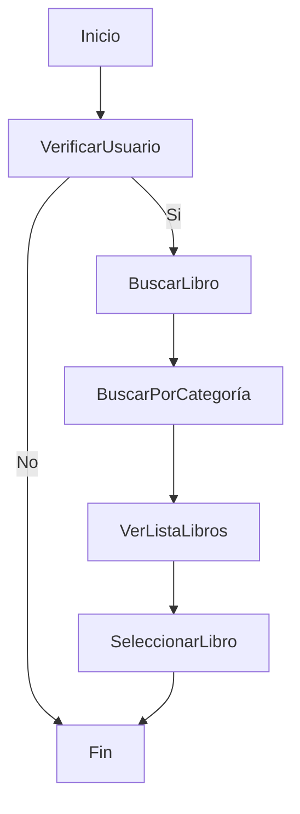
### C.U. 13 Visualizar Información
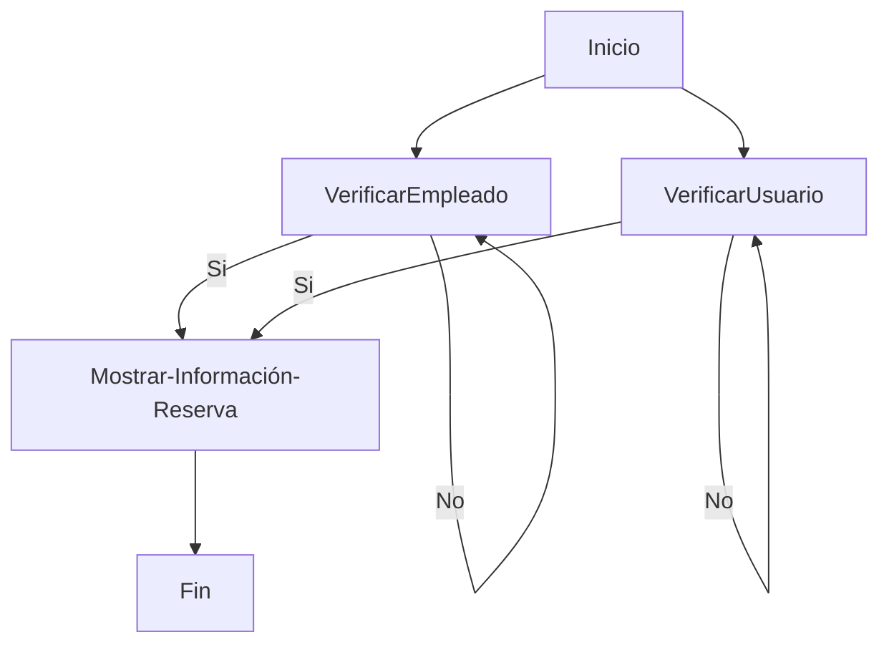

### C.U. 14 Modificar Información
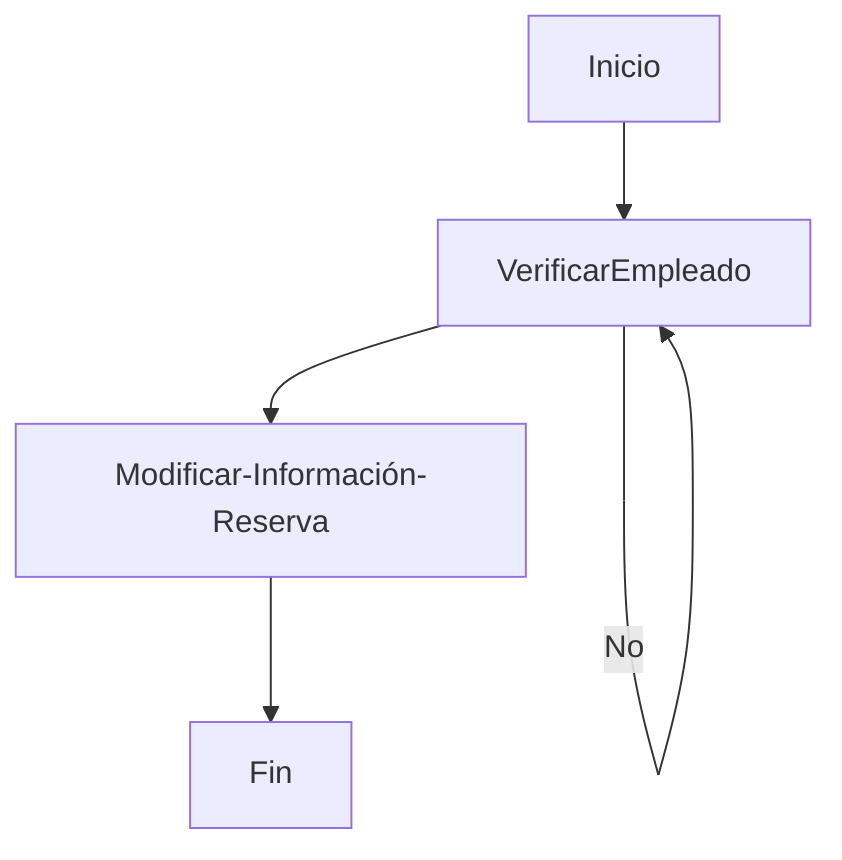
